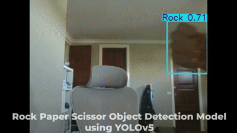

   <video src="Rock Paper Scissor Model Demo.mp4" width="600" controls></video>

# ✊✋✌️ Rock Paper Scissors Object Detection using YOLOv5 | Pretrained Model Demo

This repository contains a **real-time Rock Paper Scissors hand gesture detection system** using **YOLOv5** and Computer Vision.

The project demonstrates how to **run a pretrained YOLOv5 model** to detect Rock, Paper, and Scissors using your **webcam**.
No training is required as the model is already trained and ready to use.



**Quick Metrics:**


---

## 🚀 Features

* 🎥 Real-time webcam detection
* 🧠 Pretrained YOLOv5 model (no training required)
* ✊✌️ Detects Rock, Paper, Scissors
* ⚡ Fast and lightweight
* 🖥️ Easy setup on Windows (PowerShell)
* 🔒 No extra apps required — works on restricted school/student laptops

---

## 🧰 Tech Stack

* Python 🐍
* YOLOv5 (Ultralytics)
* PyTorch
* OpenCV
* NumPy

---

## 📦 Dataset

Dataset used to train the model:

🔗 Roboflow Dataset:
[https://universe.roboflow.com/mathias-p/rock-paper-scissors-don-t-delete](https://universe.roboflow.com/mathias-p/rock-paper-scissors-don-t-delete)

---

## 🛠 Requirements

* Python 3.8 or newer
* Visual Studio Code (VS Code) — can be installed from Microsoft Store
* A webcam

---

## 🐍 Installing Python (IMPORTANT)

If you do not already have Python installed:

1. Go to this website:
   [https://www.python.org/downloads/release/python-3100/](https://www.python.org/downloads/release/python-3100/)

2. Click:
   Windows installer (64-bit)

3. Open the downloaded installer.

4. On the first installer screen, MAKE SURE you:

   * Tick the box: Add Python to PATH

5. Then click:

   * Install Now

6. After it finishes installing, **close any open PowerShell or Terminal windows**.

7. Open PowerShell again:

   * Press Windows Key + X
   * Click Terminal or PowerShell

8. Check that Python works:

```
python --version
```

---

## 🚀 FULL SETUP GUIDE (STEP BY STEP)

### 🔹 Step 1 — Download the Repository

1. Go to this page in your browser:
   [https://github.com/Leaferd6712/Rock-Paper-Scissor-Object-Detection-YOLOv5](https://github.com/Leaferd6712/Rock-Paper-Scissor-Object-Detection-YOLOv5)

2. Click the green button **Code → Download ZIP**

3. Extract that folder and keep it in the Downloads

---

### 🔹 Step 2 — Open PowerShell and Go to the Project Folder

On Windows:

* Press Windows Key + X
* Click Terminal or PowerShell

Now enter this (IMPORTANT: change the username part):

```
cd "C:\Users\YOURUSERNAME\Downloads\Rock-Paper-Scissor-Object-Detection-YOLOv5-master\Rock-Paper-Scissor-Object-Detection-YOLOv5-master"
```

(Only the "YOURUSERNAME" part may need to be changed to your own username, otherwise the full path should work if it is kept in the downloads section of your files. Search what is my windows username for tutorials on Google.)

---

### 🔹 Step 3 — Create a Virtual Environment (Only Once)

Make sure you are inside the project folder:

```
python -m venv yolovenv
```

---

### 🔹 Step 4 — Activate the Virtual Environment

In PowerShell:

```
.\yolovenv\Scripts\Activate.ps1
```

If successful, you should see:

```
(yolovenv)
```

If PowerShell blocks it, run:

```
Set-ExecutionPolicy -Scope CurrentUser -ExecutionPolicy RemoteSigned
```

Then try again:

```
.\yolovenv\Scripts\Activate.ps1
```

---

### 🔹 Step 5 — Install Dependencies (IMPORTANT)

Make sure you see:

(yolovenv)

First, upgrade pip inside the virtual environment:

```
python -m pip install --upgrade pip
```

Then install the requirements:

```
pip install -r requirements.txt
```

---

### 🔹 Step 6 — Run the Rock Paper Scissors Detector

```
python detect.py --weights runs/train/third_run/weights/best.pt --source 0 --img-size 640 --conf-thres 0.25 --device 0
```

---

## 💡 Understanding Command Options

Here’s what the main options mean:

* `--conf-thres 0.25`
  Controls how confident the model must be before showing a detection.

  * 0.10 → more detections but more errors
  * 0.25 → good balance (default)
  * 0.50 → fewer detections but more accurate

* `--device 0`
  Selects which hardware to use:

  * `0` → first GPU (if available)
  * `cpu` → force CPU
  * If no GPU is available, YOLO automatically uses CPU

---

## 🎯 What This Does

* Opens your webcam
* Loads the trained YOLOv5 model
* Detects Rock, Paper, Scissors in real time

---

## 🔁 How to Run It Again Later

Go to the project folder (remember to change the username part if needed):

```
cd "C:\Users\YOURUSERNAME\Downloads\Rock-Paper-Scissor-Object-Detection-YOLOv5-master\Rock-Paper-Scissor-Object-Detection-YOLOv5-master"
```

Activate the virtual environment:

```
.\yolovenv\Scripts\Activate.ps1
```

Run the detector:

```
python detect.py --weights runs/train/third_run/weights/best.pt --source 0 --img-size 640 --conf-thres 0.25 --device 0
```

---

## 🧠 Notes

* Make sure your webcam is not being used by another app
* Press Q to quit the detection window


